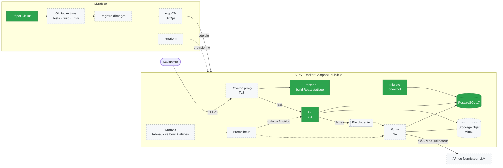
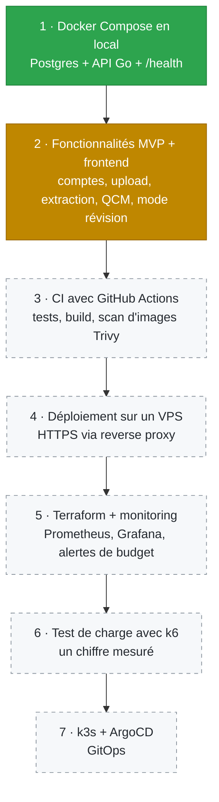
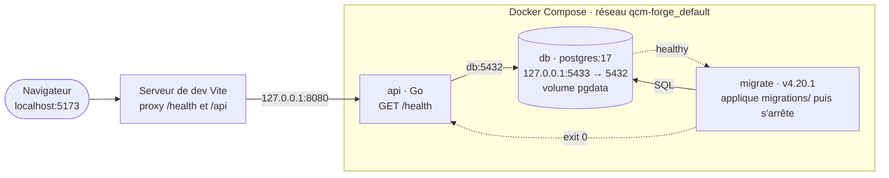

# qcm-forge

[English](README.md) · **Français**

Application web qui transforme des supports de cours (PDF, PPTX) en fiches de révision et en QCM, avec suivi des erreurs et organisation par matière. Chaque question renvoie à l'extrait du cours d'où elle vient.

Projet personnel, en solo. L'objectif est de montrer un pipeline complet : API, base de données, conteneurs, CI/CD, déploiement et observabilité. Le LLM n'est qu'une brique parmi d'autres.

**Sommaire :** [Prérequis](#prérequis) · [Démarrage rapide](#démarrage-rapide) · [Architecture cible](#architecture-cible) · [Feuille de route](#feuille-de-route) · [Architecture actuelle](#architecture-actuelle) · [État](#état) · [Structure du dépôt](#structure-du-dépôt) · [Décisions techniques](#décisions-techniques)

## Prérequis

| Outil | Pourquoi | Installation |
|---|---|---|
| Docker Engine | fait tourner la base, les migrations et l'API | [docs.docker.com/engine/install](https://docs.docker.com/engine/install/) |
| Docker Compose v2 | lance tous les services en une commande (`docker compose`, sans tiret) | [docs.docker.com/compose/install](https://docs.docker.com/compose/install/linux/) |
| Node.js 22+ et npm | uniquement pour le frontend | [nodejs.org](https://nodejs.org/) |
| curl | tester l'API depuis un terminal | généralement déjà installé |

## Démarrage rapide

```bash
git clone https://github.com/Benjylem/qcm-forge.git
cd qcm-forge
cp .env.example .env            # puis mettre un mot de passe long et alphanumérique
docker compose up -d --build    # db -> migrate -> api
docker compose ps               # db "healthy", migrate "exited (0)", api "running"
curl -i http://127.0.0.1:8080/health
```

Réponse attendue : `HTTP/1.1 200 OK` avec le corps `ok`. Si Postgres est arrêté (`docker compose stop db`), la réponse devient `503 db unreachable`.

Frontend (mode dev) :

```bash
cd frontend
npm ci
npm run dev                     # http://localhost:5173 affiche "API : ok"
```

Tout arrêter : `docker compose down`. Ajouter `-v` pour supprimer aussi le volume de la base.

Fichiers concernés : [`.env.example`](.env.example) (variables à remplir), [`docker-compose.yml`](docker-compose.yml) (services), [`frontend/vite.config.ts`](frontend/vite.config.ts) (proxy de dev).

## Architecture cible

Ce vers quoi le projet va. Les blocs verts existent déjà, les blocs en pointillés sont prévus.



## Feuille de route

Ordre strict : chaque étape est terminée et documentée ici avant de passer à la suivante.



Vert : terminé · orange : en cours · pointillés : prévu.

## Architecture actuelle



- **Ordre de démarrage :** `db` healthy → `migrate` applique les migrations et s'arrête (`service_completed_successfully`) → `api` démarre. L'API ne tourne jamais sur un schéma pas à jour.
- **Image :** l'API est construite en deux étapes depuis [`api/Dockerfile`](api/Dockerfile) : compilation dans `golang:1.26.8-alpine3.24`, puis le binaire statique (`CGO_ENABLED=0`) est copié dans `alpine:3.24.2` et s'exécute en utilisateur `nobody`.
- **Réseau :** l'API joint Postgres par le réseau interne Docker (`db:5432`). Le port `5433` côté hôte sert uniquement aux outils locaux (psql, DBeaver).
- **Exposition :** tous les ports sont liés à `127.0.0.1`, donc rien n'est accessible depuis le réseau local.
- **Pas de CORS :** en dev, le proxy Vite fait parler le navigateur à une seule origine. En production, le reverse proxy jouera le même rôle.

## État

- [x] PostgreSQL 17 via Docker Compose, avec healthcheck
- [x] API Go avec `/health` qui interroge réellement Postgres (`200 ok` / `503 db unreachable`)
- [x] Frontend React + Vite minimal qui affiche l'état de l'API
- [x] Migrations SQL versionnées (golang-migrate), table `users`
- [ ] Inscription / connexion (argon2id, sessions)
- [ ] Clé API LLM par utilisateur, chiffrée (AES-GCM)
- [ ] Upload PDF/PPTX et extraction du texte
- [ ] Génération de QCM avec explication et extrait source
- [ ] Mode révision avec suivi des erreurs
- [ ] Plafonds par utilisateur et rate limiting
- [ ] CI · VPS · Terraform · monitoring · k6 · k3s (voir [Feuille de route](#feuille-de-route))

## Structure du dépôt

| Chemin | Rôle |
|---|---|
| [`api/`](api/) | API Go |
| [`api/cmd/api/main.go`](api/cmd/api/main.go) | point d'entrée : config → pool pgx → serveur HTTP |
| [`api/internal/config/`](api/internal/config/) | lit les variables d'environnement, construit l'URL de la base |
| [`api/internal/db/`](api/internal/db/) | pool de connexions PostgreSQL (pgx) |
| [`api/internal/httpserver/`](api/internal/httpserver/) | routes HTTP (`/health`) |
| [`api/internal/auth/`](api/internal/auth/) | *(à venir)* comptes, hachage des mots de passe, sessions |
| [`api/internal/upload/`](api/internal/upload/) | *(à venir)* upload PDF/PPTX et extraction du texte |
| [`api/internal/llmprovider/`](api/internal/llmprovider/) | *(à venir)* interface Go vers le fournisseur LLM |
| [`api/internal/qcm/`](api/internal/qcm/) | *(à venir)* génération et stockage des QCM |
| [`api/Dockerfile`](api/Dockerfile) | build de l'image en plusieurs étapes |
| [`frontend/`](frontend/) | application React + TypeScript (Vite), voir [son README](frontend/README.md) |
| [`migrations/`](migrations/) | migrations SQL (`NNNNNN_nom.up.sql` / `.down.sql`) |
| [`docker-compose.yml`](docker-compose.yml) | services locaux : `db`, `migrate`, `api` |
| [`.env.example`](.env.example) | modèle du `.env` (le vrai `.env` n'est jamais commité) |
| [`.gitignore`](.gitignore) | fichiers que Git doit ignorer (`.env`, …) |

## Variables d'environnement

Définies dans `.env` (ignoré par Git), copié depuis [`.env.example`](.env.example).

| Variable | Utilisée par | Rôle | Défaut |
|---|---|---|---|
| `POSTGRES_USER` | db, migrate, api | utilisateur Postgres | — |
| `POSTGRES_PASSWORD` | db, migrate, api | mot de passe Postgres (alphanumérique : il est inséré dans une URL) | — |
| `POSTGRES_DB` | db, migrate, api | nom de la base | — |
| `POSTGRES_HOST` | api | hôte de la base | `db` (nom du service Compose) |
| `POSTGRES_PORT` | api | port de la base | `5432` (port interne au conteneur) |

## Migrations SQL

Outil : [golang-migrate](https://github.com/golang-migrate/migrate) (`migrate/migrate:v4.20.1`), lancé automatiquement par `docker compose up`.

- Chaque migration est une paire `NNNNNN_nom.up.sql` / `NNNNNN_nom.down.sql` dans [`migrations/`](migrations/).
- La table `schema_migrations` retient la dernière version appliquée ; relancer `up` affiche `no change`.
- Ne jamais modifier une migration déjà appliquée : en créer une nouvelle.

```bash
docker compose logs migrate     # ce qui a été appliqué
docker compose exec db sh -c 'psql -U "$POSTGRES_USER" -d "$POSTGRES_DB" -c "\d users"'
```

## Décisions techniques

| Choix | Pourquoi |
|---|---|
| **Go** pour l'API | Binaire statique → image Docker légère. Concurrence native pour le traitement des documents. Docker, Kubernetes et Terraform sont écrits en Go. |
| **PostgreSQL** plutôt que SQLite | L'API et un futur worker écrivent en parallèle depuis des conteneurs séparés ; JSONB pour les QCM, recherche plein texte pour les extraits. SQLite suffirait pour 3 utilisateurs, mais Postgres apprend l'exploitation d'une base client-serveur. |
| **golang-migrate** en conteneur one-shot | Schéma versionné et reproductible ; l'API ne peut pas démarrer sur un schéma pas à jour. Pas de migration automatique par un ORM : le SQL reste explicite. |
| **Chaque utilisateur fournit sa clé API LLM** | Chacun paie sa propre consommation. Les clés sont chiffrées en base (AES-GCM), jamais renvoyées au frontend, jamais écrites dans les logs. |
| **Hacher les mots de passe, chiffrer les clés API** | Un mot de passe doit seulement être vérifié → hash à sens unique (argon2id). Une clé API doit être relue pour appeler le LLM → chiffrement réversible. |
| **Fournisseur LLM derrière une interface Go** | Pas de dépendance à un seul fournisseur. |
| **Versions d'images fixées** | Builds reproductibles. Jamais `latest`. |

## Notes Fedora / SELinux

Pour monter un **dossier local** dans un conteneur, ajouter `:z` au volume (ex. `./migrations:/migrations:ro,z`), sinon SELinux bloque l'accès. Inutile pour les volumes nommés comme `pgdata`.

## Stack

- **API :** Go, `net/http`, `pgx`
- **Frontend :** React, TypeScript, Vite
- **Base de données :** PostgreSQL 17, golang-migrate
- **Conteneurs :** Docker, Docker Compose
