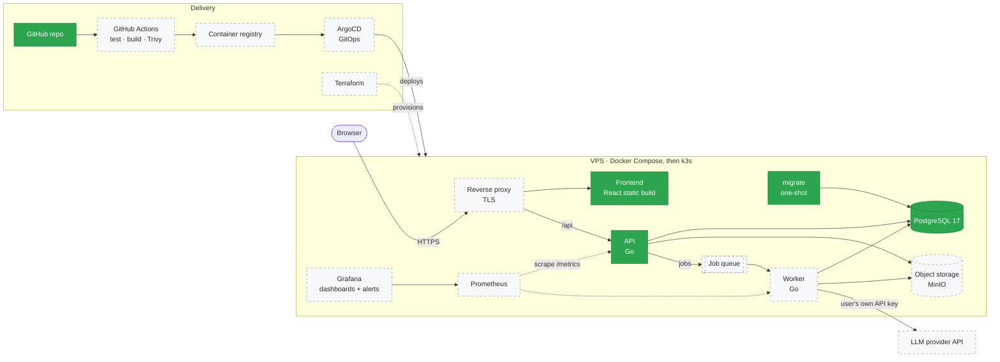
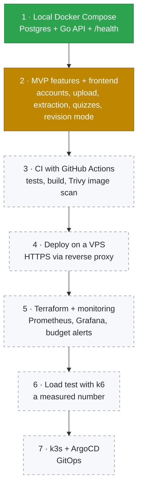
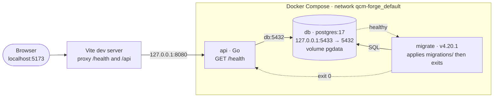

# qcm-forge

**English** · [Français](README.fr.md)

Web app that turns course material (PDF, PPTX) into revision sheets and multiple-choice quizzes, with mistake tracking and organisation by subject. Every question links back to the course excerpt it comes from.

Solo personal project. The goal is to show a complete pipeline: API, database, containers, CI/CD, deployment and observability. The LLM is just one building block.

**Contents:** [Prerequisites](#prerequisites) · [Quick start](#quick-start) · [Target architecture](#target-architecture) · [Roadmap](#roadmap) · [Current architecture](#current-architecture) · [Status](#status) · [Repository layout](#repository-layout) · [Technical decisions](#technical-decisions)

## Prerequisites

| Tool | Why | Install |
|---|---|---|
| Docker Engine | runs the database, migrations and API | [docs.docker.com/engine/install](https://docs.docker.com/engine/install/) |
| Docker Compose v2 | starts all services with one command (`docker compose`, no dash) | [docs.docker.com/compose/install](https://docs.docker.com/compose/install/linux/) |
| Node.js 22+ and npm | frontend only | [nodejs.org](https://nodejs.org/) |
| curl | test the API from a terminal | usually preinstalled |

## Quick start

```bash
git clone https://github.com/Benjylem/qcm-forge.git
cd qcm-forge
cp .env.example .env            # then set a long alphanumeric password
docker compose up -d --build    # db -> migrate -> api
docker compose ps               # db "healthy", migrate "exited (0)", api "running"
curl -i http://127.0.0.1:8080/health
```

Expected answer: `HTTP/1.1 200 OK` with body `ok`. If Postgres is down (`docker compose stop db`), it becomes `503 db unreachable`.

Frontend (dev mode):

```bash
cd frontend
npm ci
npm run dev                     # http://localhost:5173 shows "API : ok"
```

Stop everything: `docker compose down`. Add `-v` to also delete the database volume.

Files involved: [`.env.example`](.env.example) (variables to fill), [`docker-compose.yml`](docker-compose.yml) (services), [`frontend/vite.config.ts`](frontend/vite.config.ts) (dev proxy).

## Target architecture

Where the project is heading. Solid green boxes exist today, dashed boxes are planned.



## Roadmap

Strict order: each step is finished and documented here before the next one starts.



Green: done · orange: in progress · dashed: planned.

## Current architecture



- **Start order:** `db` healthy → `migrate` applies migrations and exits (`service_completed_successfully`) → `api` starts. The API never runs against an outdated schema.
- **Image:** the API is built in two stages from [`api/Dockerfile`](api/Dockerfile): compiled in `golang:1.26.8-alpine3.24`, then the static binary (`CGO_ENABLED=0`) is copied into `alpine:3.24.2` and runs as user `nobody`.
- **Network:** the API reaches Postgres on the internal Docker network (`db:5432`). Host port `5433` is only for local tools (psql, DBeaver).
- **Exposure:** every port is bound to `127.0.0.1`, so nothing is reachable from the local network.
- **No CORS needed:** in dev, the Vite proxy makes the browser talk to a single origin. In production, the reverse proxy will play the same role.

## Status

- [x] PostgreSQL 17 via Docker Compose, with healthcheck
- [x] Go API with `/health` that really pings Postgres (`200 ok` / `503 db unreachable`)
- [x] Minimal React + Vite frontend that displays the API status
- [x] Versioned SQL migrations (golang-migrate), `users` table
- [ ] Sign-up / login (argon2id, sessions)
- [ ] Per-user LLM API key, encrypted (AES-GCM)
- [ ] PDF/PPTX upload and text extraction
- [ ] Quiz generation with explanation and source excerpt
- [ ] Revision mode with mistake tracking
- [ ] Per-user limits and rate limiting
- [ ] CI · VPS · Terraform · monitoring · k6 · k3s (see [Roadmap](#roadmap))

## Repository layout

| Path | Role |
|---|---|
| [`api/`](api/) | Go API |
| [`api/cmd/api/main.go`](api/cmd/api/main.go) | entry point: config → pgx pool → HTTP server |
| [`api/internal/config/`](api/internal/config/) | reads environment variables, builds the database URL |
| [`api/internal/db/`](api/internal/db/) | PostgreSQL connection pool (pgx) |
| [`api/internal/httpserver/`](api/internal/httpserver/) | HTTP routes (`/health`) |
| [`api/internal/auth/`](api/internal/auth/) | *(planned)* accounts, password hashing, sessions |
| [`api/internal/upload/`](api/internal/upload/) | *(planned)* PDF/PPTX upload and text extraction |
| [`api/internal/llmprovider/`](api/internal/llmprovider/) | *(planned)* Go interface to the LLM provider |
| [`api/internal/qcm/`](api/internal/qcm/) | *(planned)* quiz generation and storage |
| [`api/Dockerfile`](api/Dockerfile) | multi-stage image build |
| [`frontend/`](frontend/) | React + TypeScript app (Vite), see [its README](frontend/README.md) |
| [`migrations/`](migrations/) | SQL migrations (`NNNNNN_name.up.sql` / `.down.sql`) |
| [`docker-compose.yml`](docker-compose.yml) | local services: `db`, `migrate`, `api` |
| [`.env.example`](.env.example) | template for `.env` (the real `.env` is never committed) |
| [`.gitignore`](.gitignore) | files Git must ignore (`.env`, …) |

## Environment variables

Defined in `.env` (git-ignored), copied from [`.env.example`](.env.example).

| Variable | Used by | Purpose | Default |
|---|---|---|---|
| `POSTGRES_USER` | db, migrate, api | Postgres user | — |
| `POSTGRES_PASSWORD` | db, migrate, api | Postgres password (alphanumeric: it is embedded in a URL) | — |
| `POSTGRES_DB` | db, migrate, api | database name | — |
| `POSTGRES_HOST` | api | database host | `db` (Compose service name) |
| `POSTGRES_PORT` | api | database port | `5432` (port inside the container) |

## SQL migrations

Tool: [golang-migrate](https://github.com/golang-migrate/migrate) (`migrate/migrate:v4.20.1`), run automatically by `docker compose up`.

- Each migration is a pair `NNNNNN_name.up.sql` / `NNNNNN_name.down.sql` in [`migrations/`](migrations/).
- The `schema_migrations` table stores the last applied version; running `up` again prints `no change`.
- Never edit a migration that has already been applied: add a new one.

```bash
docker compose logs migrate     # what was applied
docker compose exec db sh -c 'psql -U "$POSTGRES_USER" -d "$POSTGRES_DB" -c "\d users"'
```

## Technical decisions

| Choice | Why |
|---|---|
| **Go** for the API | Static binary → small Docker image. Native concurrency for document processing. Docker, Kubernetes and Terraform are written in Go. |
| **PostgreSQL** over SQLite | API and a future worker write concurrently from separate containers; JSONB for quizzes, full-text search for excerpts. SQLite would be enough for 3 users, but Postgres teaches how to run a client-server database. |
| **golang-migrate** as a one-shot container | Versioned, reproducible schema; the API cannot start on an outdated schema. No ORM auto-migration: the SQL stays explicit. |
| **Each user brings their own LLM API key** | Each user pays for their own usage. Keys are encrypted at rest (AES-GCM), never sent back to the frontend, never logged. |
| **Hash passwords, encrypt API keys** | A password only needs to be verified → one-way hash (argon2id). An API key must be read back to call the LLM → reversible encryption. |
| **LLM provider behind a Go interface** | No lock-in to a single provider. |
| **Pinned image versions** | Reproducible builds. Never `latest`. |

## Fedora / SELinux notes

When mounting a **local folder** into a container, add `:z` to the volume (e.g. `./migrations:/migrations:ro,z`), otherwise SELinux blocks access. Not needed for named volumes like `pgdata`.

## Stack

- **API:** Go, `net/http`, `pgx`
- **Frontend:** React, TypeScript, Vite
- **Database:** PostgreSQL 17, golang-migrate
- **Containers:** Docker, Docker Compose
